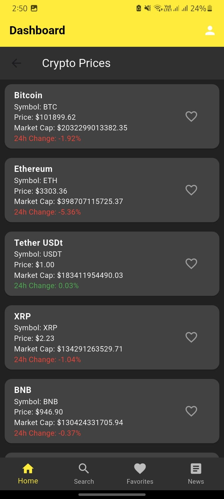
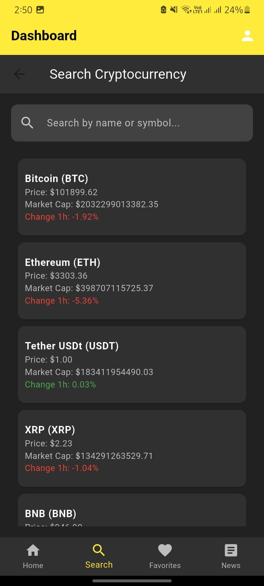
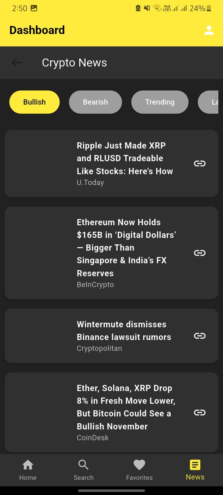
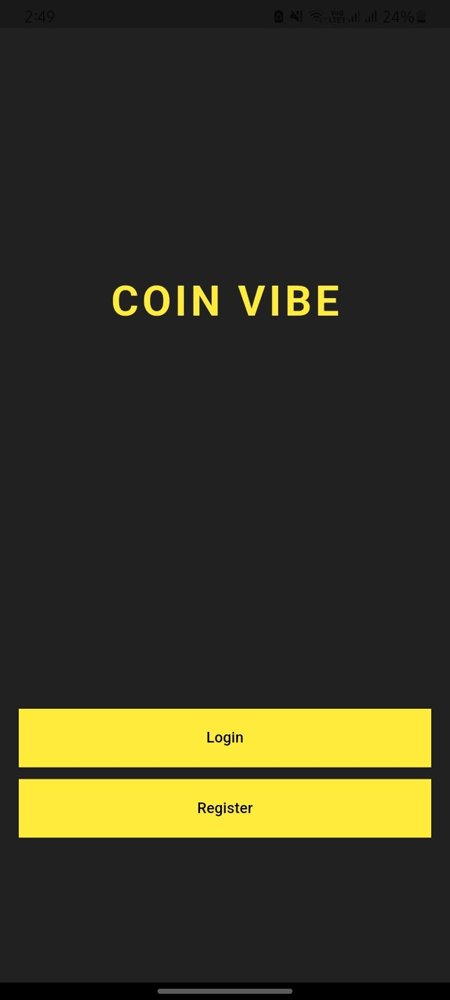

# 💹 CoinVibe – Flutter Crypto Tracker & News App# 💹 CoinVibe – Flutter Crypto Tracker & News App# 💹 CoinVibe – Flutter Crypto Tracker & News App


**CoinVibe** is a modern Flutter mobile application that delivers real-time cryptocurrency tracking, personalized favorites, intelligent search, and comprehensive crypto news — all in one sleek, responsive interface. Built for both casual investors and crypto enthusiasts, CoinVibe combines powerful functionality with an intuitive dark-themed UI.


---**CoinVibe** is a modern Flutter mobile application that delivers real-time cryptocurrency tracking, personalized favorites, intelligent search, and comprehensive crypto news — all in one sleek, responsive interface. Built for both casual investors and crypto enthusiasts, CoinVibe combines powerful functionality with an intuitive dark-themed UI.**CoinVibe** is a modern Flutter mobile application that delivers real-time cryptocurrency tracking, personalized favorites, intelligent search, and comprehensive crypto news — all in one sleek, responsive interface. Built for both casual investors and crypto enthusiasts, CoinVibe combines powerful functionality with an intuitive dark-themed UI.


## ✨ Key Features


### 📊 **Live Market Data**------

- **Real-time cryptocurrency tracking** for the top **100 cryptocurrencies**

- Live price updates, market capitalization, and 24-hour price changes

- Color-coded indicators (green for gains, red for losses)

- Powered by **CoinMarketCap Pro API** for accurate, up-to-date data## ✨ Key Features## ✨ Key Features


### 🔍 **Advanced Search**

- **Instant search** by cryptocurrency name or symbol

- Real-time filtering as you type### 📊 **Live Market Data**### 📊 **Live Market Data**

- Clean, responsive search interface with visual feedback

- **Real-time cryptocurrency tracking** for the top **100 cryptocurrencies**- **Real-time cryptocurrency tracking** for the top **100 cryptocurrencies**

### ❤️ **Personalized Favorites**

- **Add/remove favorites** with one-tap functionality- Live price updates, market capitalization, and 24-hour price changes- Live price updates, market capitalization, and 24-hour price changes

- **Real-time synchronization** across devices using Firebase Firestore

- Persistent favorites storage with user authentication- Color-coded indicators (green for gains, red for losses)- Color-coded indicators (green for gains, red for losses)

- Quick access to your preferred cryptocurrencies

- Powered by **CoinMarketCap Pro API** for accurate, up-to-date data- Powered by **CoinMarketCap Pro API** for accurate, up-to-date data

### 📰 **Comprehensive Crypto News**

- **Multi-category news feed** including:

  - 🐂 Bullish News

  - 🐻 Bearish News### 🔍 **Advanced Search**### 🔍 **Advanced Search**

  - 📈 Trending Topics

  - 🆕 Latest Updates- **Instant search** by cryptocurrency name or symbol- **Instant search** by cryptocurrency name or symbol

  - ⭐ Handpicked Articles

- **Detailed news viewer** with full article content- Real-time filtering as you type- Real-time filtering as you type

- **Image-rich articles** with source attribution

- Powered by **CoinStats API** for diverse news sources- Clean, responsive search interface with visual feedback- Clean, responsive search interface with visual feedback


### 🔐 **Secure Authentication**

- **Firebase Authentication** with email/password

- **Google Sign-In** integration for seamless login### ❤️ **Personalized Favorites**### ❤️ **Personalized Favorites**

- User profile management and data persistence

- **Add/remove favorites** with one-tap functionality- **Add/remove favorites** with one-tap functionality

---

- **Real-time synchronization** across devices using Firebase Firestore- **Real-time synchronization** across devices using Firebase Firestore

## 📱 Screenshots

- Persistent favorites storage with user authentication- Persistent favorites storage with user authentication

### **Dashboard Screen**

- Quick access to your preferred cryptocurrencies- Quick access to your preferred cryptocurrencies

*The main dashboard displaying live cryptocurrency data with favorites functionality*


### **Search Screen**

### 📰 **Comprehensive Crypto News**### 📰 **Comprehensive Crypto News**

*Advanced search functionality to find cryptocurrencies by name or symbol*

- **Multi-category news feed** including:- **Multi-category news feed** including:

### **News Screen**

  - 🐂 Bullish News  - 🐂 Bullish News

*Comprehensive crypto news feed with multiple categories*

  - 🐻 Bearish News  - 🐻 Bearish News

### **Login/Register Screen**

  - 📈 Trending Topics  - 📈 Trending Topics

*Secure authentication with Firebase and Google Sign-In*

  - 🆕 Latest Updates  - 🆕 Latest Updates

### **Profile Screen**

  - ⭐ Handpicked Articles  - ⭐ Handpicked Articles

*User profile management and settings*

- **Detailed news viewer** with full article content- **Detailed news viewer** with full article content

---

- **Image-rich articles** with source attribution- **Image-rich articles** with source attribution

## 🛠️ Technology Stack

- Powered by **CoinStats API** for diverse news sources- Powered by **CoinStats API** for diverse news sources

### **Core Framework**

- **Flutter 3.5.4+** - Cross-platform mobile development

- **Dart 3.5.4+** - Modern, type-safe programming language

### 🔐 **Secure Authentication**### 🔐 **Secure Authentication**

### **Backend & APIs**

- **Firebase Core** - App initialization and configuration- **Firebase Authentication** with email/password- **Firebase Authentication** with email/password

- **Firebase Auth** - User authentication and security

- **Firebase Firestore** - Real-time NoSQL database for favorites- **Google Sign-In** integration for seamless login- **Google Sign-In** integration for seamless login

- **CoinMarketCap Pro API** - Cryptocurrency market data

- **CoinStats API** - Cryptocurrency news and analysis- User profile management and data persistence- User profile management and data persistence


### **State Management & UI**

- **setState()** - Flutter's built-in state management

- **Provider** - Dependency injection and state management (ready for expansion)------

- **Material Design 3** - Modern, responsive UI components

- **Custom Themes** - Dark mode optimized for crypto trading


### **Networking & Data**## 🛠️ Technology Stack## 🛠️ Technology Stack

- **HTTP Package** - RESTful API communication

- **JSON Parsing** - Efficient data serialization

- **Async Programming** - Future-based operations with error handling

### **Core Framework**### **Core Framework**

### **Additional Libraries**

- **Google Sign-In** - OAuth2 authentication- **Flutter 3.5.4+** - Cross-platform mobile development- **Flutter 3.5.4+** - Cross-platform mobile development

- **FL Chart** - Chart visualization (ready for implementation)

- **Intl** - Internationalization support- **Dart 3.5.4+** - Modern, type-safe programming language- **Dart 3.5.4+** - Modern, type-safe programming language

- **Flutter Launcher Icons** - Custom app icons


---

### **Backend & APIs**### **Backend & APIs**

## 🚀 Getting Started

- **Firebase Core** - App initialization and configuration- **Firebase Core** - App initialization and configuration

### Prerequisites

- **Firebase Auth** - User authentication and security- **Firebase Auth** - User authentication and security

- **Flutter SDK** (3.5.4 or higher)

- **Android Studio** or **VS Code** with Flutter extensions- **Firebase Firestore** - Real-time NoSQL database for favorites- **Firebase Firestore** - Real-time NoSQL database for favorites

- **Android SDK** with API level 21+ (Android 5.0+)

- Valid API keys from:- **CoinMarketCap Pro API** - Cryptocurrency market data- **CoinMarketCap Pro API** - Cryptocurrency market data

  - [CoinMarketCap Pro API](https://coinmarketcap.com/api/)

  - [CoinStats API](https://coinstats.app/api)- **CoinStats API** - Cryptocurrency news and analysis- **CoinStats API** - Cryptocurrency news and analysis


### Installation


1. **Clone the repository**### **State Management & UI**### **State Management & UI**

   ```bash

   git clone https://github.com/Mwahib001/CoinVibe-Flutter.git- **setState()** - Flutter's built-in state management- **setState()** - Flutter's built-in state management

   cd CoinVibe-Flutter

   ```- **Provider** - Dependency injection and state management (ready for expansion)- **Provider** - Dependency injection and state management (ready for expansion)


2. **Install dependencies**- **Material Design 3** - Modern, responsive UI components- **Material Design 3** - Modern, responsive UI components

   ```bash

   flutter pub get- **Custom Themes** - Dark mode optimized for crypto trading- **Custom Themes** - Dark mode optimized for crypto trading

   ```


3. **Configure Firebase**

   - Create a Firebase project at [Firebase Console](https://console.firebase.google.com/)### **Networking & Data**### **Networking & Data**

   - Enable Authentication and Firestore Database

   - Download `google-services.json` and place it in `android/app/`- **HTTP Package** - RESTful API communication- **HTTP Package** - RESTful API communication

   - Update `firebase_options.dart` with your configuration

- **JSON Parsing** - Efficient data serialization- **JSON Parsing** - Efficient data serialization

4. **Configure API Keys**

   - Update API keys in the service files:- **Async Programming** - Future-based operations with error handling- **Async Programming** - Future-based operations with error handling

     - `lib/services/coin_list_service.dart` - CoinMarketCap API key

     - `lib/views/news_section.dart` - CoinStats API key


5. **Run the app**### **Additional Libraries**### **Additional Libraries**

   ```bash

   flutter run- **Google Sign-In** - OAuth2 authentication- **Google Sign-In** - OAuth2 authentication

   ```

- **FL Chart** - Chart visualization (ready for implementation)- **FL Chart** - Chart visualization (ready for implementation)

### Building for Production

- **Intl** - Internationalization support- **Intl** - Internationalization support

**Android APK:**

```bash- **Flutter Launcher Icons** - Custom app icons- **Flutter Launcher Icons** - Custom app icons

flutter build apk --release

```


**Android App Bundle:**------

```bash

flutter build appbundle --release

```

## 🚀 Getting Started## 🚀 Getting Started

---


## 📱 App Architecture

### Prerequisites### Prerequisites

### **Project Structure**

```

lib/

├── main.dart                 # App entry point & routing- **Flutter SDK** (3.5.4 or higher)- **Flutter SDK** (3.5.4 or higher)

├── firebase_options.dart     # Firebase configuration

├── screens/                  # Main app screens- **Android Studio** or **VS Code** with Flutter extensions- **Android Studio** or **VS Code** with Flutter extensions

│   ├── dashboard.dart        # Main dashboard with navigation

│   ├── login.dart           # User authentication- **Android SDK** with API level 21+ (Android 5.0+)- **Android SDK** with API level 21+ (Android 5.0+)

│   ├── register.dart        # User registration

│   ├── main_screen.dart     # Welcome screen- Valid API keys from:- Valid API keys from:

│   └── splash.dart          # App splash screen

├── views/                    # Feature-specific views  - [CoinMarketCap Pro API](https://coinmarketcap.com/api/)  - [CoinMarketCap Pro API](https://coinmarketcap.com/api/)

│   ├── display_coin.dart     # Cryptocurrency list display

│   ├── search_view.dart      # Search functionality  - [CoinStats API](https://coinstats.app/api)  - [CoinStats API](https://coinstats.app/api)

│   ├── favorites.dart        # Favorites management

│   ├── news_section.dart     # News feed

│   └── profile_view.dart     # User profile

├── services/                 # API services & business logic### Installation### Installation

│   ├── coin_list_service.dart # CoinMarketCap API integration

│   ├── coin_news_service.dart # News API (alternative)

│   ├── fetch_crypto.dart     # Crypto data fetching

│   ├── google_sign.dart      # Google authentication1. **Clone the repository**1. **Clone the repository**

│   └── live_charts.dart      # Chart data (future feature)

├── modules/                  # Data models   ```bash   `ash

│   ├── coin_list_model.dart  # Cryptocurrency data model

│   └── coin_news.dart        # News data model   git clone https://github.com/Mwahib001/CoinVibe-Flutter.git   git clone https://github.com/Mwahib001/CoinVibe-Flutter.git

└── assets/                   # Static assets

    ├── images/              # App images   cd CoinVibe-Flutter   cd CoinVibe-Flutter

    └── jsonData/            # Static data files

```   ```   `


### **State Management**

- **Local State**: `setState()` for UI updates within screens

- **Global State**: Provider pattern ready for complex state management2. **Install dependencies**2. **Install dependencies**

- **Persistent State**: Firebase Firestore for user preferences

   ```bash   `ash

### **Navigation**

- **Named Routes**: Clean, scalable navigation system   flutter pub get   flutter pub get

- **Bottom Navigation**: Tab-based navigation for main features

- **Stack Navigation**: Modal screens for details and authentication   ```   `


---


## 🔧 Configuration3. **Configure Firebase**3. **Configure Firebase**


### **API Keys Setup**   - Create a Firebase project at [Firebase Console](https://console.firebase.google.com/)   - Create a Firebase project at [Firebase Console](https://console.firebase.google.com/)


**CoinMarketCap API:**   - Enable Authentication and Firestore Database   - Enable Authentication and Firestore Database

```dart

// In lib/services/coin_list_service.dart   - Download `google-services.json` and place it in `android/app/`   - Download google-services.json and place it in ndroid/app/

final String _apiKey = 'YOUR_COINMARKETCAP_API_KEY';

```   - Update `firebase_options.dart` with your configuration   - Update irebase_options.dart with your configuration


**CoinStats API:**

```dart

// In lib/views/news_section.dart4. **Configure API Keys**4. **Configure API Keys**

const String apiKey = 'YOUR_COINSTATS_API_KEY';

```   - Update API keys in the service files:   - Update API keys in the service files:


### **Firebase Configuration**     - `lib/services/coin_list_service.dart` - CoinMarketCap API key     - lib/services/coin_list_service.dart - CoinMarketCap API key

Ensure your `android/app/build.gradle` includes:

```gradle     - `lib/views/news_section.dart` - CoinStats API key     - lib/views/news_section.dart - CoinStats API key

apply plugin: 'com.google.gms.google-services'

```


---5. **Run the app**5. **Run the app**


## 🎨 UI/UX Design   ```bash   `ash


### **Design Principles**   flutter run   flutter run

- **Dark Theme Optimized** - Easy on the eyes for extended use

- **Material Design 3** - Modern, accessible components   ```   `

- **Responsive Layout** - Adapts to different screen sizes

- **Intuitive Navigation** - Bottom tabs with clear icons

- **Visual Feedback** - Loading states, error handling, success messages

### Building for Production### Building for Production

### **Color Scheme**

- **Primary**: Yellow (#FFEB3B) for accents and highlights

- **Background**: Dark Gray (#121212) for main screens

- **Cards**: Medium Gray (#424242) for content containers**Android APK:****Android APK:**

- **Text**: White (#FFFFFF) with gray variants for hierarchy

```bash`ash

---

flutter build apk --releaseflutter build apk --release

## 📈 Performance Features

````

- **Efficient API Calls** - Cached data with smart refresh intervals

- **Lazy Loading** - List virtualization for smooth scrolling

- **Error Handling** - Graceful failure states with retry options

- **Memory Management** - Proper disposal of controllers and listeners**Android App Bundle:****Android App Bundle:**

- **Real-time Updates** - Firebase listeners for live data synchronization

```bash`ash

---

flutter build appbundle --releaseflutter build appbundle --release

## 🔒 Security & Privacy

````

- **Secure API Keys** - Environment-based configuration

- **Firebase Security Rules** - Database access control

- **OAuth2 Integration** - Secure Google authentication

- **Data Encryption** - Firebase's built-in encryption------

- **User Data Protection** - GDPR-compliant data handling


---

## 📱 App Architecture## 📱 App Architecture

## 🚀 Future Enhancements


- **Price Charts** - Interactive candlestick charts with FL Chart

- **Push Notifications** - Price alerts and news updates### **Project Structure**### **Project Structure**

- **Portfolio Tracking** - Investment portfolio management

- **Multi-language Support** - Internationalization with Intl````

- **Offline Mode** - Cached data for offline viewing

- **Watchlist** - Advanced watchlist with custom alertslib/lib/


---├── main.dart                 # App entry point & routing├── main.dart                 # App entry point & routing


## 🧪 Testing├── firebase_options.dart     # Firebase configuration├── firebase_options.dart     # Firebase configuration


Run tests:├── screens/                  # Main app screens├── screens/                  # Main app screens

```bash

flutter test│   ├── dashboard.dart        # Main dashboard with navigation│   ├── dashboard.dart        # Main dashboard with navigation

```

│   ├── login.dart           # User authentication│   ├── login.dart           # User authentication

Run integration tests:

```bash│   ├── register.dart        # User registration│   ├── register.dart        # User registration

flutter drive --target=test_driver/app.dart

```│   ├── main_screen.dart     # Welcome screen│   ├── main_screen.dart     # Welcome screen


---│   └── splash.dart          # App splash screen│   └── splash.dart          # App splash screen


## 📝 Contributing├── views/                    # Feature-specific views├── views/                    # Feature-specific views


1. Fork the repository│   ├── display_coin.dart     # Cryptocurrency list display│   ├── display_coin.dart     # Cryptocurrency list display

2. Create a feature branch (`git checkout -b feature/amazing-feature`)

3. Commit your changes (`git commit -m 'Add amazing feature'`)│   ├── search_view.dart      # Search functionality│   ├── search_view.dart      # Search functionality

4. Push to the branch (`git push origin feature/amazing-feature`)

5. Open a Pull Request│   ├── favorites.dart        # Favorites management│   ├── favorites.dart        # Favorites management


---│   ├── news_section.dart     # News feed│   ├── news_section.dart     # News feed


## 📄 License│   └── profile_view.dart     # User profile│   └── profile_view.dart     # User profile


This project is licensed under the MIT License - see the [LICENSE](LICENSE) file for details.├── services/                 # API services & business logic├── services/                 # API services & business logic


---│   ├── coin_list_service.dart # CoinMarketCap API integration│   ├── coin_list_service.dart # CoinMarketCap API integration


## 👨‍💻 Developer│   ├── coin_news_service.dart # News API (alternative)│   ├── coin_news_service.dart # News API (alternative)


**Muhammad Wahib**│   ├── fetch_crypto.dart     # Crypto data fetching│   ├── fetch_crypto.dart     # Crypto data fetching

- GitHub: [@Mwahib001](https://github.com/Mwahib001)

- LinkedIn: [Your LinkedIn Profile]│   ├── google_sign.dart      # Google authentication│   ├── google_sign.dart      # Google authentication


---│   └── live_charts.dart      # Chart data (future feature)│   └── live_charts.dart      # Chart data (future feature)


## 🙏 Acknowledgments├── modules/                  # Data models├── modules/                  # Data models


- **CoinMarketCap** for providing comprehensive cryptocurrency data│   ├── coin_list_model.dart  # Cryptocurrency data model│   ├── coin_list_model.dart  # Cryptocurrency data model

- **CoinStats** for rich crypto news content

- **Firebase** for robust backend services│   └── coin_news.dart        # News data model│   └── coin_news.dart        # News data model

- **Flutter Team** for the amazing cross-platform framework

└── assets/                   # Static assets└── assets/                   # Static assets

---

    ├── images/              # App images    ├── images/              # App images

*Built with ❤️ using Flutter*
    └── jsonData/            # Static data files    └── jsonData/            # Static data files

````


### **State Management**### **State Management**

- **Local State**: `setState()` for UI updates within screens- **Local State**: setState() for UI updates within screens

- **Global State**: Provider pattern ready for complex state management- **Global State**: Provider pattern ready for complex state management

- **Persistent State**: Firebase Firestore for user preferences- **Persistent State**: Firebase Firestore for user preferences


### **Navigation**### **Navigation**

- **Named Routes**: Clean, scalable navigation system- **Named Routes**: Clean, scalable navigation system

- **Bottom Navigation**: Tab-based navigation for main features- **Bottom Navigation**: Tab-based navigation for main features

- **Stack Navigation**: Modal screens for details and authentication- **Stack Navigation**: Modal screens for details and authentication


------


## 🔧 Configuration## 🔧 Configuration


### **API Keys Setup**### **API Keys Setup**


**CoinMarketCap API:****CoinMarketCap API:**

```dart`dart

// In lib/services/coin_list_service.dart// In lib/services/coin_list_service.dart

final String _apiKey = 'YOUR_COINMARKETCAP_API_KEY';final String _apiKey = 'YOUR_COINMARKETCAP_API_KEY';

````


**CoinStats API:****CoinStats API:**

```dart`dart

// In lib/views/news_section.dart// In lib/views/news_section.dart

const String apiKey = 'YOUR_COINSTATS_API_KEY';const String apiKey = 'YOUR_COINSTATS_API_KEY';

````


### **Firebase Configuration**### **Firebase Configuration**

Ensure your `android/app/build.gradle` includes:Ensure your ndroid/app/build.gradle includes:

```gradle`gradle

apply plugin: 'com.google.gms.google-services'apply plugin: 'com.google.gms.google-services'

````


------


## 🎨 UI/UX Design## 🎨 UI/UX Design


### **Design Principles**### **Design Principles**

- **Dark Theme Optimized** - Easy on the eyes for extended use- **Dark Theme Optimized** - Easy on the eyes for extended use

- **Material Design 3** - Modern, accessible components- **Material Design 3** - Modern, accessible components

- **Responsive Layout** - Adapts to different screen sizes- **Responsive Layout** - Adapts to different screen sizes

- **Intuitive Navigation** - Bottom tabs with clear icons- **Intuitive Navigation** - Bottom tabs with clear icons

- **Visual Feedback** - Loading states, error handling, success messages- **Visual Feedback** - Loading states, error handling, success messages


### **Color Scheme**### **Color Scheme**

- **Primary**: Yellow (#FFEB3B) for accents and highlights- **Primary**: Yellow (#FFEB3B) for accents and highlights

- **Background**: Dark Gray (#121212) for main screens- **Background**: Dark Gray (#121212) for main screens

- **Cards**: Medium Gray (#424242) for content containers- **Cards**: Medium Gray (#424242) for content containers

- **Text**: White (#FFFFFF) with gray variants for hierarchy- **Text**: White (#FFFFFF) with gray variants for hierarchy


------


## 📈 Performance Features## 📈 Performance Features


- **Efficient API Calls** - Cached data with smart refresh intervals- **Efficient API Calls** - Cached data with smart refresh intervals

- **Lazy Loading** - List virtualization for smooth scrolling- **Lazy Loading** - List virtualization for smooth scrolling

- **Error Handling** - Graceful failure states with retry options- **Error Handling** - Graceful failure states with retry options

- **Memory Management** - Proper disposal of controllers and listeners- **Memory Management** - Proper disposal of controllers and listeners

- **Real-time Updates** - Firebase listeners for live data synchronization- **Real-time Updates** - Firebase listeners for live data synchronization


------


## 🔒 Security & Privacy## 🔒 Security & Privacy


- **Secure API Keys** - Environment-based configuration- **Secure API Keys** - Environment-based configuration

- **Firebase Security Rules** - Database access control- **Firebase Security Rules** - Database access control

- **OAuth2 Integration** - Secure Google authentication- **OAuth2 Integration** - Secure Google authentication

- **Data Encryption** - Firebase's built-in encryption- **Data Encryption** - Firebase's built-in encryption

- **User Data Protection** - GDPR-compliant data handling- **User Data Protection** - GDPR-compliant data handling


------


## 🚀 Future Enhancements## 🚀 Future Enhancements


- **Price Charts** - Interactive candlestick charts with FL Chart- **Price Charts** - Interactive candlestick charts with FL Chart

- **Push Notifications** - Price alerts and news updates- **Push Notifications** - Price alerts and news updates

- **Portfolio Tracking** - Investment portfolio management- **Portfolio Tracking** - Investment portfolio management

- **Multi-language Support** - Internationalization with Intl- **Multi-language Support** - Internationalization with Intl

- **Offline Mode** - Cached data for offline viewing- **Offline Mode** - Cached data for offline viewing

- **Watchlist** - Advanced watchlist with custom alerts- **Watchlist** - Advanced watchlist with custom alerts


------


## 🧪 Testing## 🧪 Testing


Run tests:Run tests:

```bash`ash

flutter testflutter test

````


Run integration tests:Run integration tests:

```bash`ash

flutter drive --target=test_driver/app.dartflutter drive --target=test_driver/app.dart

````


------


## 📝 Contributing## 📝 Contributing


1. Fork the repository1. Fork the repository

2. Create a feature branch (`git checkout -b feature/amazing-feature`)2. Create a feature branch (git checkout -b feature/amazing-feature)

3. Commit your changes (`git commit -m 'Add amazing feature'`)3. Commit your changes (git commit -m 'Add amazing feature')

4. Push to the branch (`git push origin feature/amazing-feature`)4. Push to the branch (git push origin feature/amazing-feature)

5. Open a Pull Request5. Open a Pull Request


------


## 📄 License## 📄 License


This project is licensed under the MIT License - see the [LICENSE](LICENSE) file for details.This project is licensed under the MIT License - see the [LICENSE](LICENSE) file for details.


------


## 👨‍💻 Developer## 👨‍💻 Developer


**Muhammad Wahib****Muhammad Wahib**

- GitHub: [@Mwahib001](https://github.com/Mwahib001)- GitHub: [@Mwahib001](https://github.com/Mwahib001)

- LinkedIn: [Your LinkedIn Profile]- LinkedIn: [Your LinkedIn Profile]


------


## 🙏 Acknowledgments## 🙏 Acknowledgments


- **CoinMarketCap** for providing comprehensive cryptocurrency data- **CoinMarketCap** for providing comprehensive cryptocurrency data

- **CoinStats** for rich crypto news content- **CoinStats** for rich crypto news content

- **Firebase** for robust backend services- **Firebase** for robust backend services

- **Flutter Team** for the amazing cross-platform framework- **Flutter Team** for the amazing cross-platform framework


------


*Built with ❤️ using Flutter**Built with ❤️ using Flutter*
